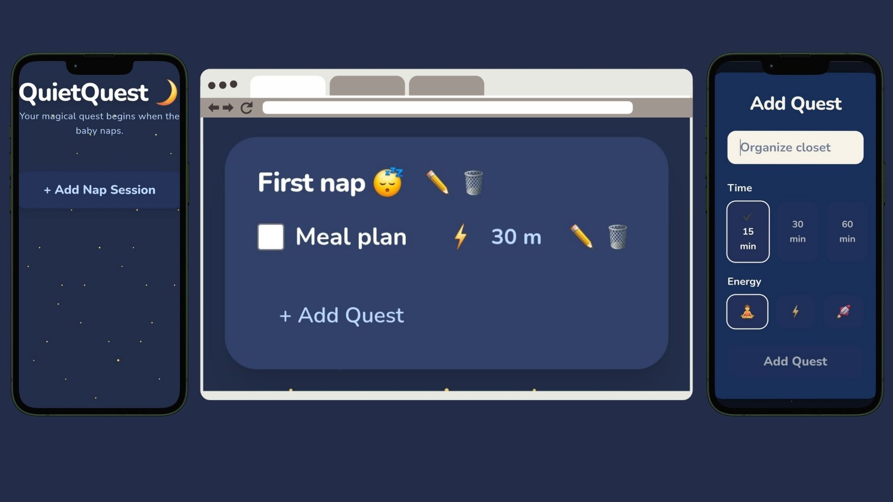

# 💤 QuietQuest

**QuietQuest** is a calming side project built by me, a mom and software engineer, to help myself and other moms turn baby nap time into moments of focus and self-care (because we deserve some me-time too!)
It’s a simple React app designed to schedule “quests” (tasks) during nap sessions (or even wake-windows). Just add a nap session, the quests you want to get done during that time, and start checking things off!

> “Built during naps, with vibes and AI assistance (Cursor)”

---

## 🌟 Features

- ⏱️ **Nap Timer** – Track how long your baby’s nap has lasted  
- ✅ **Quests** – Create short, focused tasks organized by nap session. You can even tag these with how long they will take and how much energy you'll need!
- 💾 **LocalStorage** – Your data stays safe without sign-ins  
- 🎨 **Soothing UI** – Calming dark blues, rounded cards, and playful icons

---

## 🛠️ Tech Stack

- **React**
- **TypeScript**
- **Tailwind CSS** for styling
- **LocalStorage** for persistence
- **AI-assisted development** using ChatGPT & Cursor

---

## 📦 Getting Started
You can clone this yourself or try it out [on my domain](https://quiet-quest.meeralq.com/).

### 1. Clone the repo
```bash
git clone https://github.com/MeeralQureshi/quietquest.git
cd quietquest
```

### 2. Install dependencies
```bash
npm install
```

### 3. Start the dev server
```bash
npm start
```

---

## 🚀 Deployment

This app is deployed using [Vercel](https://vercel.com/). Try it out [on my domain](https://quiet-quest.meeralq.com/)

---

## 📁 Project Structure

```
src/
├── components/        // Reusable UI components (NapCard, QuestCard, Modal)
├── pages/             // Main views (Dashboard)
├── types/             // Type interfaces
├── utils/             // localStorage helpers
└── App.tsx
```

---

## 📸 Sneak Peek



---

## 💡 Inspiration

I built this because I wanted to be more productive while my baby was napping. I essentially wanted a way to organize tasks by nap/wake-windows. Inspired by:

- 🐉 The games I play with "side-quests"
- 🌙 Dark mode/cozy aesthetics
- 🤖 Wanting to try out "vibe-coding" with Cursor
